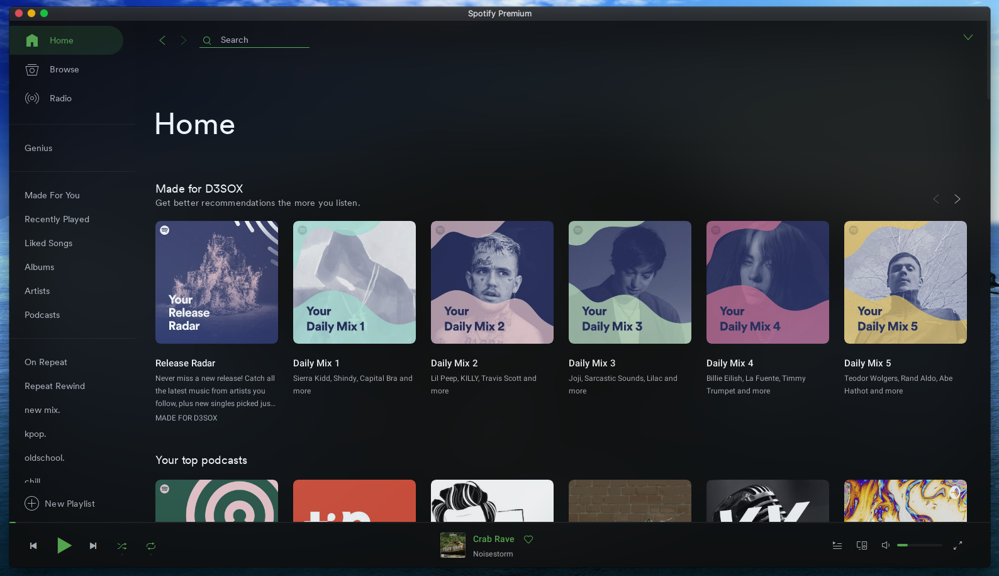
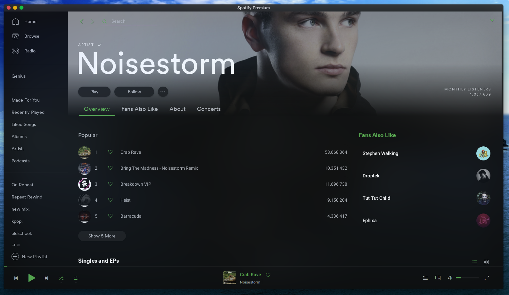
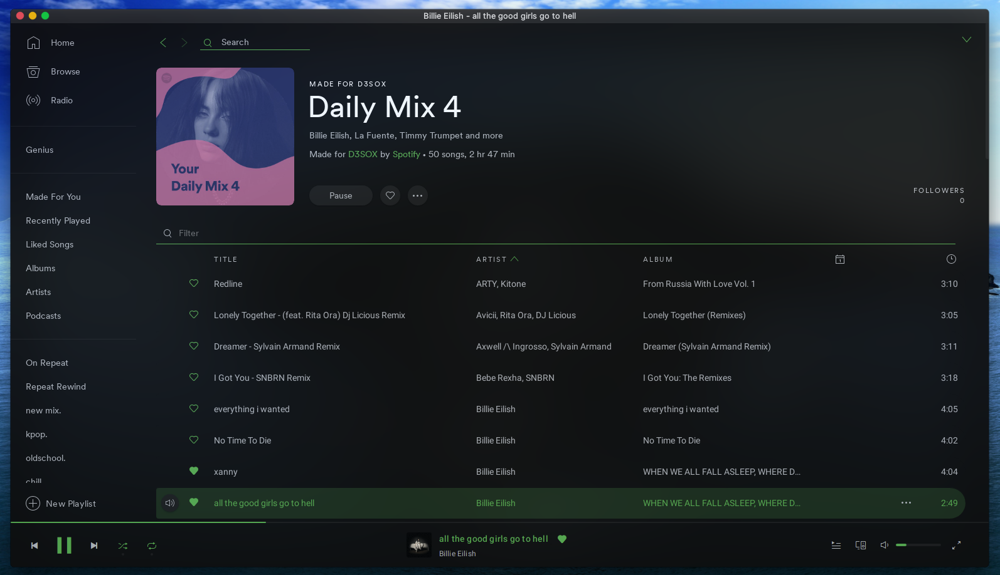
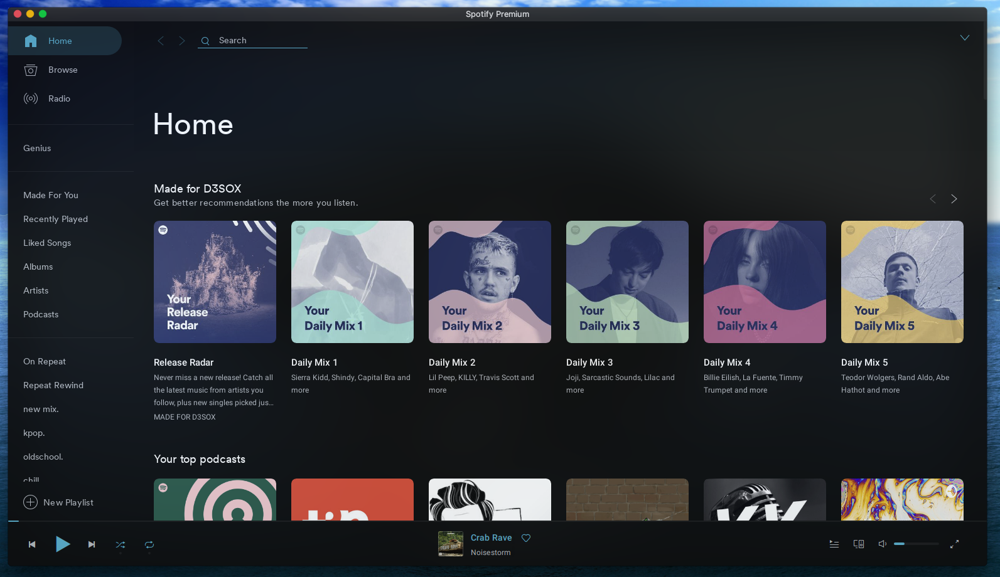
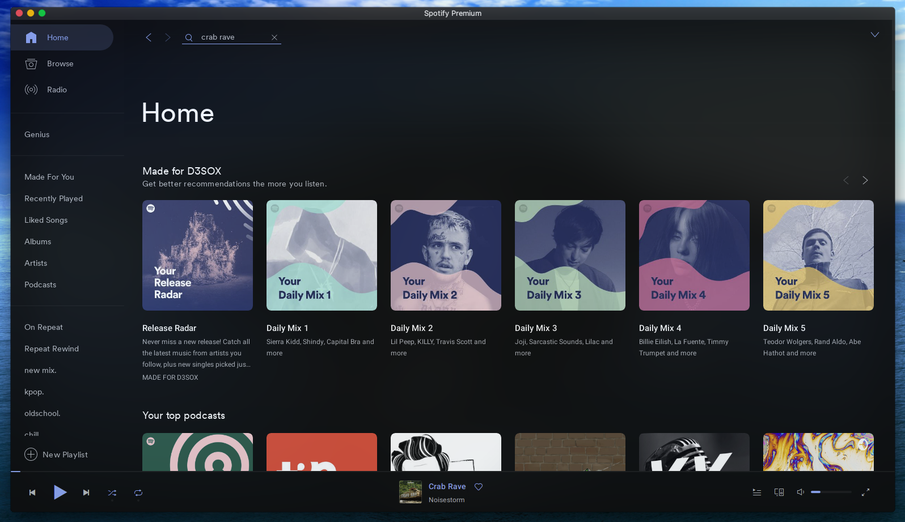
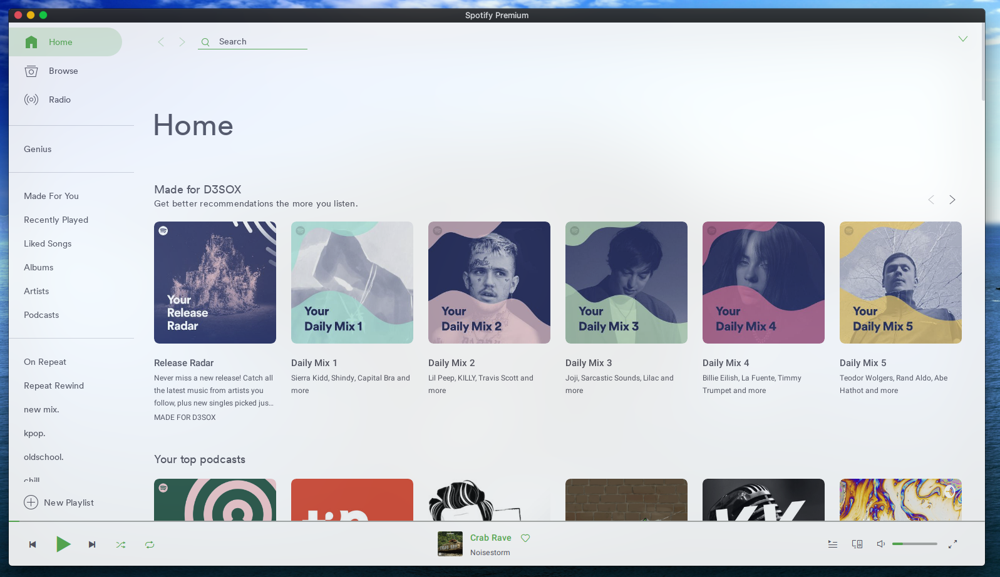
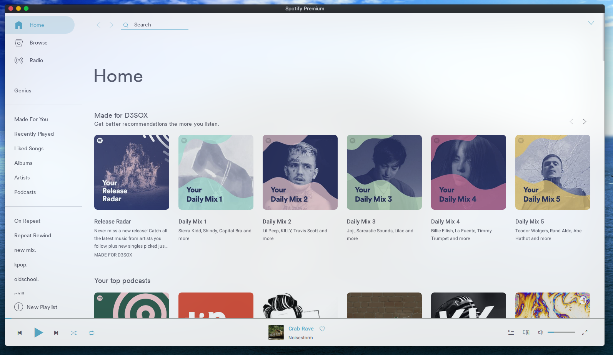
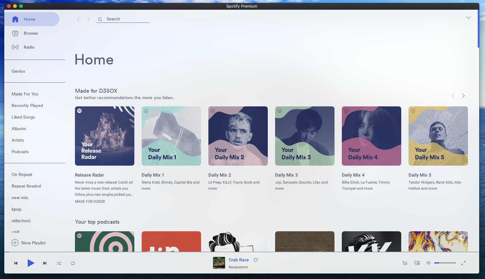
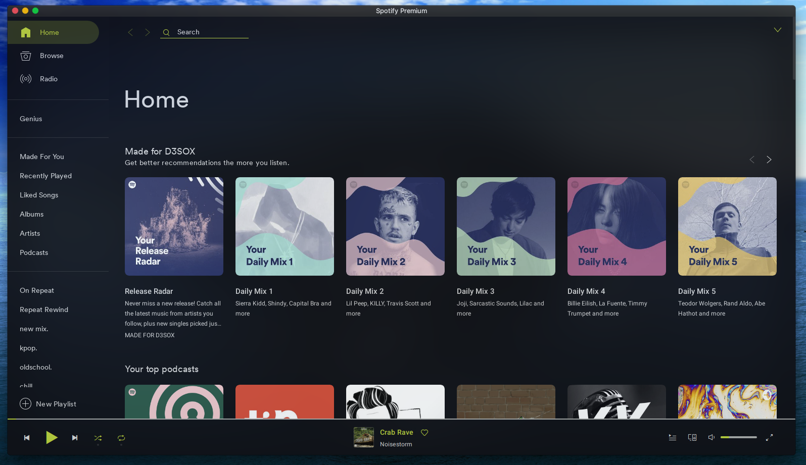

# google-spicetify
Spotify with Google style

## My Changes
- Improved color schemes
- Volume always visible
- Style download progress, offline indicator, tracklist sort arrow
- Remove artist page separator line
- Round selected item end like selected playlist
- Round artist page popular tracks cover image
- Move left sidebar a bit up
- Hover to view friend list

## Previews
Using `Base` color scheme

#### Home


#### Artist


#### Playlist


## How to install
1. Install [spicetify-cli](https://github.com/khanhas/spicetify-cli) and make sure it applies default theme succesfully.
2. Run these commands:
  
**Linux and MacOS** in Bash:
```bash
cd "$(dirname "$(spicetify -c)")/Themes"
git clone https://github.com/D3S0X/google-spicetify
```

**Windows** in Powershell:
```powershell
cd "$(spicetify -c | Split-Path)\Themes"
git clone https://github.com/D3S0X/google-spicetify
```

3. Finally, run:
```
spicetify config current_theme google-spicetify
spicetify apply
```

There are 7 color schemes you can choose: `Base`, `DarkWater`, `DarkBlue`, `LightGreen`, `LightWater`, `LightBlue`, `Gow`. Change scheme with commands:
```
spicetify config color_scheme <scheme name>
spicetify apply
```

## Color schemes preview

#### Base

See [Previews section](#Previews)

#### DarkWater


#### DarkBlue


#### LightGreen


#### LightWater


#### LightBlue


#### Gow
